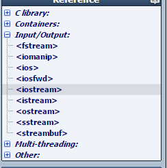

# Entry 2: Baby Steps

This week, I learned that I needed to take baby steps in order for me to fully 
understand something. I spent a lot of time testing out how I could output "Hello World" in
the console, in many ways. 

## What I learned

Something that I learned from my research, so far was that there are a lot of different 
libraries within C++ and is included by inputting it in the header.

For example:

## Brain Thoughts

* DON'T FORGET SEMICOLONS!!!
* Fully understand something before you move on to more complicated stuff!

## Takeaways

[**Back**](entry01-plan.md) 

[**Menu**](../README.md) 

[**Next**](entry03-.md)