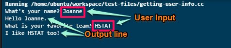

# Entry 5: Outputting User Info
While learning new functions, I went back to when I was learning the basics of coding. When
learning a new language, my class would always learn how to output strings and functions.
So, I decided to try to find out how I could output strings with the user's input. 

## What I learned/Questions Answered
* Getline is a function in which it prompts a line of string that is outputted before and
grabs whatever is inputted by the user in the command line.

<!--**Questions from Entry 3** -->
<!--[preprocessor directives c++](https://www.google.com/search?q=Preprocessor+directive&oq=Preprocessor+directive&aqs=chrome..69i57.366j0j1&sourceid=chrome&es_sm=91&ie=UTF-8#safe=strict&q=preprocessor+directives+c%2B%2B)-->

## Brain Thoughts/Questions to Answer

## Takeaways

## Refernces
* http://www.cplusplus.com/forum/beginner/111268/

[**Back**](entry04-the-exploring.md) [**Menu**](../README.md) [**Next**](entry06-.md) 